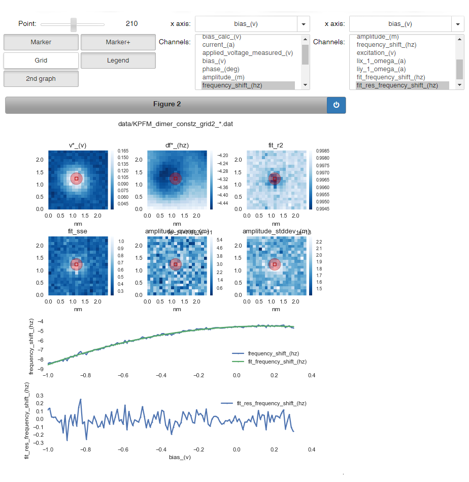

# grid*ex*

Python scripts to analyze 3D grid data. It currently works for Nanonis data (in binary or ASCII file format).

Fitting
- [KPFM (Δf vs. V) curves](https://www.nature.com/articles/nnano.2012.20),
- [IZ spectroscopy](https://journals.aps.org/prb/abstract/10.1103/PhysRevB.92.235443) curves,
- multiple Gaussian peaks,
- linear polynomials,
- arbitrary functions
is implemented.

An example output is shown here:

Also check out the [example jupyter notebook](https://github.com/alexriss/gridex/blob/master/gridex_ipython_example.ipynb). The interactive controls are not displayed when rendering it, but will be available when running the notebook.

## Related projects

- [SpmImageTycoon.jl](https://github.com/alexriss/SpmImageTycoon.jl): App to organize SPM images and spectra.
- [SpmImages.jl](https://github.com/alexriss/SpmImages.jl): Julia library to read and display SPM images.
- [SpmSpectroscopy.jl](https://github.com/alexriss/SpmSpectroscopy.jl): Julia library to analyze scanning tunneling and atomic force spectroscopy data.
- [SpmGrids.jl](https://github.com/alexriss/SpmGrids.jl): Julia library to read and analyze SPM grid spectroscopy.
- [imag*ex*](https://github.com/alexriss/imagex): Python scripts to analyze scanning probe images.

